# College Learning Management System - ERD

```mermaid
erDiagram
    %% ==================== CORE ACADEMIC HIERARCHY ====================
    Department ||--o{ Program : "offers"
    Department ||--o{ Teacher : "employs"
    
    Program ||--o{ Semester : "contains"
    Program ||--o{ Student : "enrolls"
    
    Semester ||--o{ Subject : "includes"
    Semester ||--o{ StudentSubject : "tracks_enrollment"
    
    Subject ||--o{ TeacherSubject : "assigned_to"
    Subject ||--o{ StudentSubject : "enrolled_by"
    Subject ||--o{ Assignment : "has"
    Subject ||--o{ Attendance : "records"
    
    %% ==================== PEOPLE RELATIONSHIPS ====================
    Teacher ||--o{ TeacherSubject : "teaches"
    Teacher ||--o{ Assignment : "creates"
    Teacher ||--o{ Grade : "assigns"
    Teacher ||--o{ Attendance : "marks"
    
    Student ||--o{ StudentSubject : "enrolls_in"
    Student ||--o{ SubmissionHistory : "submits"
    Student ||--o{ Attendance : "attends"
    
    %% ==================== ACADEMIC WORKFLOW ====================
    Assignment ||--o{ SubmissionHistory : "receives"
    SubmissionHistory ||--o| Grade : "graded_as"
    
    %% ==================== ADMINISTRATION ====================
    Admin ||--o{ Event : "creates"

    %% ==================== ENTITY DEFINITIONS ====================

    Department {
        uuid id PK
        string name "NOT NULL"
        string code UK "NOT NULL, max_length=20"
        text description "NULLABLE"
        datetime created_at "auto_now_add"
        datetime updated_at "auto_now"
    }

    Program {
        uuid id PK
        uuid department_id FK "NOT NULL"
        string name "NOT NULL, max_length=200"
        string code UK "NOT NULL, max_length=20"
        int duration_years "DEFAULT=4"
        text description "NULLABLE"
        datetime created_at "auto_now_add"
        datetime updated_at "auto_now"
    }

    Semester {
        uuid id PK
        uuid program_id FK "NOT NULL"
        int number "NOT NULL"
        string name "NOT NULL, max_length=100"
        datetime created_at "auto_now_add"
        datetime updated_at "auto_now"
    }

    Subject {
        uuid id PK
        uuid semester_id FK "NOT NULL"
        string name "NOT NULL, max_length=200"
        string code UK "NOT NULL, max_length=20"
        text description "NULLABLE"
        int credit_hours "DEFAULT=3"
        datetime created_at "auto_now_add"
        datetime updated_at "auto_now"
    }

    Student {
        uuid id PK
        uuid user_id FK "NULLABLE, OneToOne"
        uuid program_id FK "NOT NULL"
        string enrollment_number UK "auto_generated"
        string full_name "NOT NULL, max_length=200"
        string email UK "NOT NULL"
        string phone "NULLABLE, max_length=20"
        string gender "CHOICES: male,female,other"
        date date_of_birth "NULLABLE"
        string blood_group "NULLABLE"
        string nationality "DEFAULT=Pakistani"
        string cnic UK "NULLABLE, max_length=15"
        text address "NULLABLE"
        string city "NULLABLE"
        string postal_code "NULLABLE"
        string emergency_contact_name "NULLABLE"
        string emergency_contact_phone "NULLABLE"
        string profile_image "NULLABLE"
        int enrollment_year "NOT NULL"
        int current_semester "DEFAULT=1"
        string father_name "NULLABLE"
        string mother_name "NULLABLE"
        string guardian_phone "NULLABLE"
        text previous_education "NULLABLE"
        boolean is_active "DEFAULT=true"
        boolean is_verified "DEFAULT=false"
        boolean is_suspended "DEFAULT=false"
        datetime verified_at "NULLABLE"
        datetime suspended_at "NULLABLE"
        datetime last_login_at "NULLABLE"
        int edit_count "DEFAULT=0"
        text notes "NULLABLE"
        datetime created_at "auto_now_add"
        datetime updated_at "auto_now"
    }

    Teacher {
        uuid id PK
        uuid user_id FK "NULLABLE, OneToOne"
        uuid department_id FK "NOT NULL"
        string employee_id UK "auto_generated"
        string full_name "NOT NULL, max_length=200"
        string email UK "NOT NULL"
        string phone "NULLABLE, max_length=20"
        string gender "CHOICES: male,female,other"
        date date_of_birth "NULLABLE"
        string blood_group "NULLABLE"
        string nationality "DEFAULT=Pakistani"
        string cnic UK "NULLABLE, max_length=15"
        text address "NULLABLE"
        string city "NULLABLE"
        string postal_code "NULLABLE"
        string emergency_contact_name "NULLABLE"
        string emergency_contact_phone "NULLABLE"
        string profile_image "NULLABLE"
        string qualification "NULLABLE, max_length=200"
        string designation "NULLABLE"
        date joining_date "NULLABLE"
        string specialization "NULLABLE"
        int experience_years "DEFAULT=0"
        boolean is_active "DEFAULT=true"
        boolean is_verified "DEFAULT=false"
        boolean is_suspended "DEFAULT=false"
        datetime verified_at "NULLABLE"
        datetime suspended_at "NULLABLE"
        datetime last_login_at "NULLABLE"
        int edit_count "DEFAULT=0"
        text notes "NULLABLE"
        datetime created_at "auto_now_add"
        datetime updated_at "auto_now"
    }

    Admin {
        uuid id PK
        uuid user_id FK "NULLABLE, OneToOne"
        string admin_id UK "auto_generated"
        string full_name "NOT NULL, max_length=200"
        string email UK "NOT NULL"
        string phone "NULLABLE, max_length=20"
        string gender "CHOICES: male,female,other"
        date date_of_birth "NULLABLE"
        string blood_group "NULLABLE"
        string nationality "DEFAULT=Pakistani"
        string cnic UK "NULLABLE, max_length=15"
        text address "NULLABLE"
        string city "NULLABLE"
        string postal_code "NULLABLE"
        string emergency_contact_name "NULLABLE"
        string emergency_contact_phone "NULLABLE"
        string profile_image "NULLABLE"
        string role "DEFAULT=Administrator"
        string permissions_level "CHOICES: super,admin,moderator"
        boolean is_active "DEFAULT=true"
        boolean is_verified "DEFAULT=false"
        boolean is_suspended "DEFAULT=false"
        datetime verified_at "NULLABLE"
        datetime suspended_at "NULLABLE"
        datetime last_login_at "NULLABLE"
        int edit_count "DEFAULT=0"
        text notes "NULLABLE"
        datetime created_at "auto_now_add"
        datetime updated_at "auto_now"
    }

    TeacherSubject {
        uuid id PK
        uuid teacher_id FK "NOT NULL"
        uuid subject_id FK "NOT NULL"
        datetime created_at "auto_now_add"
        datetime updated_at "auto_now"
    }

    StudentSubject {
        uuid id PK
        uuid student_id FK "NOT NULL"
        uuid subject_id FK "NOT NULL"
        uuid semester_id FK "NOT NULL"
        date enrollment_date "auto_now_add"
        datetime created_at "auto_now_add"
        datetime updated_at "auto_now"
    }

    Assignment {
        uuid id PK
        uuid subject_id FK "NOT NULL"
        uuid created_by_id FK "NOT NULL, Teacher"
        string title "NOT NULL, max_length=200"
        text description "NOT NULL"
        datetime due_date "NOT NULL"
        decimal total_marks "DEFAULT=100.00"
        datetime created_at "auto_now_add"
        datetime updated_at "auto_now"
    }

    SubmissionHistory {
        uuid id PK
        uuid assignment_id FK "NOT NULL"
        uuid student_id FK "NOT NULL"
        datetime submitted_at "auto_now_add"
        string file_url "NULLABLE, max_length=500"
        string file_upload "NULLABLE"
        text submission_text "NULLABLE"
        datetime created_at "auto_now_add"
        datetime updated_at "auto_now"
    }

    Grade {
        uuid id PK
        uuid submission_id FK "NOT NULL, OneToOne"
        uuid graded_by_id FK "NOT NULL, Teacher"
        string grade_value "CHOICES: A+,A,A-,B+,B,B-,C+,C,C-,D,F"
        decimal marks_obtained "NOT NULL"
        text feedback "NULLABLE"
        datetime graded_at "auto_now_add"
        datetime created_at "auto_now_add"
        datetime updated_at "auto_now"
    }

    Attendance {
        uuid id PK
        uuid subject_id FK "NOT NULL"
        uuid student_id FK "NOT NULL"
        uuid marked_by_id FK "NOT NULL, Teacher"
        date session_date "NOT NULL"
        string status "CHOICES: present,absent,late,excused"
        datetime marked_at "auto_now_add"
        datetime created_at "auto_now_add"
        datetime updated_at "auto_now"
    }

    Event {
        uuid id PK
        uuid created_by_id FK "NOT NULL, Admin"
        string title "NOT NULL, max_length=200"
        text description "NOT NULL"
        date event_date "NOT NULL"
        string event_type "CHOICES: holiday,exam,meeting,workshop,other"
        datetime created_at "auto_now_add"
        datetime updated_at "auto_now"
    }
```

## Relationship Summary

| Parent Entity | Child Entity | Relationship Type | Description |
|---------------|--------------|-------------------|-------------|
| Department | Program | One-to-Many | A department offers multiple programs |
| Department | Teacher | One-to-Many | A department employs multiple teachers |
| Program | Semester | One-to-Many | A program contains multiple semesters |
| Program | Student | One-to-Many | A program enrolls multiple students |
| Semester | Subject | One-to-Many | A semester includes multiple subjects |
| Semester | StudentSubject | One-to-Many | Semester tracks student enrollments |
| Subject | TeacherSubject | One-to-Many | Subject assigned to teachers (M:N junction) |
| Subject | StudentSubject | One-to-Many | Subject enrolled by students (M:N junction) |
| Subject | Assignment | One-to-Many | Subject has multiple assignments |
| Subject | Attendance | One-to-Many | Subject has attendance records |
| Teacher | TeacherSubject | One-to-Many | Teacher teaches subjects (M:N junction) |
| Teacher | Assignment | One-to-Many | Teacher creates assignments |
| Teacher | Grade | One-to-Many | Teacher assigns grades |
| Teacher | Attendance | One-to-Many | Teacher marks attendance |
| Student | StudentSubject | One-to-Many | Student enrolls in subjects (M:N junction) |
| Student | SubmissionHistory | One-to-Many | Student submits assignments |
| Student | Attendance | One-to-Many | Student attendance records |
| Assignment | SubmissionHistory | One-to-Many | Assignment receives submissions |
| SubmissionHistory | Grade | One-to-One | Submission graded as grade |
| Admin | Event | One-to-Many | Admin creates events |

## Unique Constraints

| Table | Columns | Constraint Type |
|-------|---------|-----------------|
| Department | code | UNIQUE |
| Program | code | UNIQUE |
| Semester | program_id + number | UNIQUE TOGETHER |
| Subject | code | UNIQUE |
| Student | email, enrollment_number, cnic | UNIQUE |
| Teacher | email, employee_id, cnic | UNIQUE |
| Admin | email, admin_id, cnic | UNIQUE |
| TeacherSubject | teacher_id + subject_id | UNIQUE TOGETHER |
| StudentSubject | student_id + subject_id + semester_id | UNIQUE TOGETHER |
| SubmissionHistory | assignment_id + student_id | UNIQUE TOGETHER |
| Attendance | subject_id + student_id + session_date | UNIQUE TOGETHER |

## Indexes

| Table | Indexed Fields |
|-------|----------------|
| Student | email, phone, is_active, created_at |
| Teacher | email, phone, is_active, created_at |
| Admin | email, phone, is_active, created_at |
| Attendance | session_date, status |
| Assignment | due_date |
| Grade | grade_value |
| Event | event_date, event_type |
