# Learning Management System (LMS) - Entity-Relationship Model

## Overview

This document presents a complete Entity-Relationship (ER) model for a Learning Management System.
The **Institution** is the top-level entity, with all other entities logically organized beneath it.

---

## ER Diagram (Mermaid)

```mermaid
erDiagram
    %% ==================== TOP-LEVEL: INSTITUTION ====================
    Institution ||--o{ Department : "has_many"
    
    %% ==================== ACADEMIC HIERARCHY ====================
    Department ||--o{ Program : "offers"
    Department ||--o{ Teacher : "employs"
    
    Program ||--o{ Semester : "contains"
    Program ||--o{ Student : "enrolls"
    
    Semester ||--o{ Subject : "includes"
    
    %% ==================== SUBJECT RELATIONSHIPS ====================
    Subject ||--o{ TeacherSubject : "assigned_via"
    Subject ||--o{ StudentSubject : "enrolled_via"
    Subject ||--o{ Assignment : "has"
    Subject ||--o{ Attendance : "tracks"
    
    %% ==================== PEOPLE RELATIONSHIPS ====================
    Teacher ||--o{ TeacherSubject : "teaches"
    Teacher ||--o{ Assignment : "creates"
    Teacher ||--o{ Grade : "assigns"
    Teacher ||--o{ Attendance : "marks"
    
    Student ||--o{ StudentSubject : "enrolls_in"
    Student ||--o{ SubmissionHistory : "submits"
    Student ||--o{ Attendance : "has"
    
    %% ==================== ACADEMIC WORKFLOW ====================
    Assignment ||--o{ SubmissionHistory : "receives"
    SubmissionHistory ||--|| Grade : "graded_as"
    
    %% ==================== ADMINISTRATION ====================
    Admin ||--o{ Event : "creates"
    
    %% ==================== DJANGO AUTH ====================
    User ||--o| Student : "authenticates"
    User ||--o| Teacher : "authenticates"
    User ||--o| Admin : "authenticates"

    %% ==================== ENTITY DEFINITIONS ====================

    Institution {
        uuid id PK
        string name "NOT NULL, max=300"
        string short_name "max=50"
        string code UK "NOT NULL, max=20"
        string email "NULLABLE"
        string phone "NULLABLE"
        string website "NULLABLE"
        text address "NULLABLE"
        string city "NULLABLE"
        string state "NULLABLE"
        string country "DEFAULT=Pakistan"
        string postal_code "NULLABLE"
        int established_year "NULLABLE"
        image logo "NULLABLE"
        text description "NULLABLE"
        boolean is_active "DEFAULT=true"
        datetime created_at "auto"
        datetime updated_at "auto"
    }

    Department {
        uuid id PK
        uuid institution_id FK "Links to Institution"
        string name "NOT NULL, max=200"
        string code UK "NOT NULL, max=20"
        string head_of_department "NULLABLE"
        string email "NULLABLE"
        string phone "NULLABLE"
        text description "NULLABLE"
        boolean is_active "DEFAULT=true"
        datetime created_at "auto"
        datetime updated_at "auto"
    }

    Program {
        uuid id PK
        uuid department_id FK "Links to Department"
        string name "NOT NULL, max=200"
        string code UK "NOT NULL, max=20"
        int duration_years "DEFAULT=4"
        text description "NULLABLE"
    }

    Semester {
        uuid id PK
        uuid program_id FK "Links to Program"
        int number "NOT NULL"
        string name "NOT NULL, max=100"
    }

    Subject {
        uuid id PK
        uuid semester_id FK "Links to Semester"
        string name "NOT NULL, max=200"
        string code UK "NOT NULL, max=20"
        text description "NULLABLE"
        int credit_hours "DEFAULT=3"
    }

    Student {
        uuid id PK
        uuid user_id FK "OneToOne with User"
        uuid program_id FK "Links to Program"
        string enrollment_number UK "Auto-generated"
        string full_name "NOT NULL"
        string email UK "NOT NULL"
        string phone "NULLABLE"
        string gender "CHOICES"
        date date_of_birth "NULLABLE"
        string blood_group "NULLABLE"
        string cnic UK "NULLABLE"
        text address "NULLABLE"
        int enrollment_year "NOT NULL"
        int current_semester "DEFAULT=1"
        string father_name "NULLABLE"
        string mother_name "NULLABLE"
        boolean is_active "DEFAULT=true"
        boolean is_verified "DEFAULT=false"
        datetime created_at "auto"
        datetime updated_at "auto"
    }

    Teacher {
        uuid id PK
        uuid user_id FK "OneToOne with User"
        uuid department_id FK "Links to Department"
        string employee_id UK "Auto-generated"
        string full_name "NOT NULL"
        string email UK "NOT NULL"
        string phone "NULLABLE"
        string gender "CHOICES"
        string qualification "NULLABLE"
        string designation "NULLABLE"
        date joining_date "NULLABLE"
        string specialization "NULLABLE"
        int experience_years "DEFAULT=0"
        boolean is_active "DEFAULT=true"
        boolean is_verified "DEFAULT=false"
        datetime created_at "auto"
        datetime updated_at "auto"
    }

    Admin {
        uuid id PK
        uuid user_id FK "OneToOne with User"
        string admin_id UK "Auto-generated"
        string full_name "NOT NULL"
        string email UK "NOT NULL"
        string phone "NULLABLE"
        string role "DEFAULT=Administrator"
        string permissions_level "CHOICES: super,admin,moderator"
        boolean is_active "DEFAULT=true"
        datetime created_at "auto"
        datetime updated_at "auto"
    }

    User {
        int id PK "Django Auth User"
        string username UK
        string email UK
        string password "hashed"
        string first_name
        string last_name
        boolean is_active
        datetime last_login
        datetime date_joined
    }

    TeacherSubject {
        uuid id PK
        uuid teacher_id FK "Links to Teacher"
        uuid subject_id FK "Links to Subject"
    }

    StudentSubject {
        uuid id PK
        uuid student_id FK "Links to Student"
        uuid subject_id FK "Links to Subject"
        uuid semester_id FK "Links to Semester"
        date enrollment_date "auto"
    }

    Assignment {
        uuid id PK
        uuid subject_id FK "Links to Subject"
        uuid created_by FK "Links to Teacher"
        string title "NOT NULL, max=200"
        text description "NOT NULL"
        datetime due_date "NOT NULL"
        decimal total_marks "DEFAULT=100"
        datetime created_at "auto"
        datetime updated_at "auto"
    }

    SubmissionHistory {
        uuid id PK
        uuid assignment_id FK "Links to Assignment"
        uuid student_id FK "Links to Student"
        datetime submitted_at "auto"
        string file_url "NULLABLE"
        file file_upload "NULLABLE"
        text submission_text "NULLABLE"
    }

    Grade {
        uuid id PK
        uuid submission_id FK "OneToOne with Submission"
        uuid graded_by FK "Links to Teacher"
        string grade_value "CHOICES: A+,A,A-,...,F"
        decimal marks_obtained "NOT NULL"
        text feedback "NULLABLE"
        datetime graded_at "auto"
    }

    Attendance {
        uuid id PK
        uuid subject_id FK "Links to Subject"
        uuid student_id FK "Links to Student"
        uuid marked_by FK "Links to Teacher"
        date session_date "NOT NULL"
        string status "CHOICES: present,absent,late,excused"
        datetime marked_at "auto"
    }

    Event {
        uuid id PK
        uuid created_by FK "Links to Admin"
        string title "NOT NULL, max=200"
        text description "NOT NULL"
        date event_date "NOT NULL"
        string event_type "CHOICES: holiday,exam,meeting,workshop,other"
        datetime created_at "auto"
    }
```



---

## Hierarchical Structure (Text Representation)

```
INSTITUTION (Top-Level Entity)
│
├── DEPARTMENT (1:N) ─────────────────────────────────────────────┐
│   │                                                              │
│   ├── PROGRAM (1:N)                                              │
│   │   │                                                          │
│   │   ├── SEMESTER (1:N)                                         │
│   │   │   │                                                      │
│   │   │   └── SUBJECT (1:N)                                      │
│   │   │       ├── Assignment (1:N) ──► SubmissionHistory (1:N)   │
│   │   │       │                              └── Grade (1:1)     │
│   │   │       ├── Attendance (1:N)                               │
│   │   │       ├── TeacherSubject (M:N Junction)                  │
│   │   │       └── StudentSubject (M:N Junction)                  │
│   │   │                                                          │
│   │   └── STUDENT (1:N) ─── User (1:1)                           │
│   │                                                              │
│   └── TEACHER (1:N) ─── User (1:1)                               │
│                                                                  │
└── (Admin entities exist independently with User 1:1)            │
                                                                   │
ADMIN ─── User (1:1)                                               │
   └── EVENT (1:N)                                                 │
```

---

## Relationship Summary Table

| Parent Entity       | Child Entity       | Relationship | Related Name       | Description                                      |
|---------------------|--------------------|--------------|--------------------|--------------------------------------------------|
| **Institution**     | Department         | 1:N          | `departments`      | An institution has many departments              |
| **Department**      | Program            | 1:N          | `programs`         | A department offers many programs                |
| **Department**      | Teacher            | 1:N          | `teachers`         | A department employs many teachers               |
| **Program**         | Semester           | 1:N          | `semesters`        | A program contains many semesters                |
| **Program**         | Student            | 1:N          | `students`         | A program enrolls many students                  |
| **Semester**        | Subject            | 1:N          | `subjects`         | A semester includes many subjects                |
| **Semester**        | StudentSubject     | 1:N          | `student_enrollments` | Tracks student enrollments per semester       |
| **Subject**         | TeacherSubject     | 1:N          | `assigned_teachers`| Junction: Subject assigned to teachers           |
| **Subject**         | StudentSubject     | 1:N          | `enrolled_students`| Junction: Subject enrolled by students           |
| **Subject**         | Assignment         | 1:N          | `assignments`      | A subject has many assignments                   |
| **Subject**         | Attendance         | 1:N          | `attendance_records`| A subject has attendance records                |
| **Teacher**         | TeacherSubject     | 1:N          | `teaching_subjects`| Junction: Teacher teaches subjects               |
| **Teacher**         | Assignment         | 1:N          | `created_assignments`| Teacher creates assignments                    |
| **Teacher**         | Grade              | 1:N          | `graded_assignments`| Teacher grades submissions                      |
| **Teacher**         | Attendance         | 1:N          | `marked_attendance`| Teacher marks attendance                         |
| **Student**         | StudentSubject     | 1:N          | `enrolled_subjects`| Junction: Student enrolls in subjects            |
| **Student**         | SubmissionHistory  | 1:N          | `submissions`      | Student submits assignments                      |
| **Student**         | Attendance         | 1:N          | `attendance_records`| Student has attendance records                  |
| **Assignment**      | SubmissionHistory  | 1:N          | `submissions`      | Assignment receives submissions                  |
| **SubmissionHistory**| Grade             | 1:1          | `grade`            | One submission has one grade (OneToOne)          |
| **Admin**           | Event              | 1:N          | `created_events`   | Admin creates events                             |
| **User**            | Student            | 1:1          | `student_profile`  | Django User authenticates Student                |
| **User**            | Teacher            | 1:1          | `teacher_profile`  | Django User authenticates Teacher                |
| **User**            | Admin              | 1:1          | `admin_profile`    | Django User authenticates Admin                  |

---

## Unique Constraints

| Table              | Unique Columns                             | Type            |
|--------------------|--------------------------------------------|-----------------|
| Institution        | `code`                                     | UNIQUE          |
| Department         | `code`                                     | UNIQUE          |
| Program            | `code`                                     | UNIQUE          |
| Semester           | `program_id` + `number`                    | UNIQUE TOGETHER |
| Subject            | `code`                                     | UNIQUE          |
| Student            | `email`, `enrollment_number`, `cnic`       | UNIQUE          |
| Teacher            | `email`, `employee_id`, `cnic`             | UNIQUE          |
| Admin              | `email`, `admin_id`, `cnic`                | UNIQUE          |
| TeacherSubject     | `teacher_id` + `subject_id`                | UNIQUE TOGETHER |
| StudentSubject     | `student_id` + `subject_id` + `semester_id`| UNIQUE TOGETHER |
| SubmissionHistory  | `assignment_id` + `student_id`             | UNIQUE TOGETHER |
| Attendance         | `subject_id` + `student_id` + `session_date`| UNIQUE TOGETHER|

---

## Cardinality Notation

| Symbol | Meaning                    |
|--------|----------------------------|
| `||`   | Exactly one (mandatory)    |
| `|o`   | Zero or one (optional)     |
| `o{`   | Zero or many               |
| `|{`   | One or many                |

---

## Notes

1. **Institution** is the root entity. All departments, and consequently all programs, teachers, and students, belong to an institution.

2. **BaseProfile** is an abstract model that `Student`, `Teacher`, and `Admin` inherit from. It provides common fields like `full_name`, `email`, `phone`, `address`, `profile_image`, etc.

3. **Junction Tables** (`TeacherSubject`, `StudentSubject`) handle the Many-to-Many relationships and allow for additional metadata (e.g., enrollment date).

4. **User** (Django's built-in authentication model) has a **One-to-One** relationship with each profile type, enabling login functionality.

5. All primary keys use **UUID** for security and distributed system compatibility.
